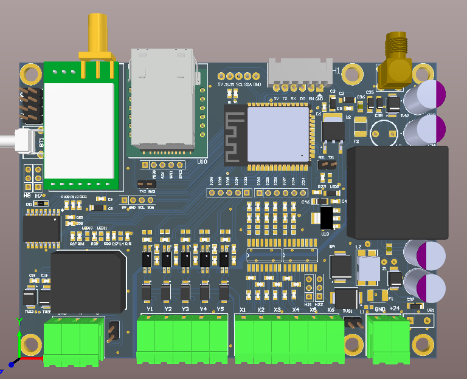
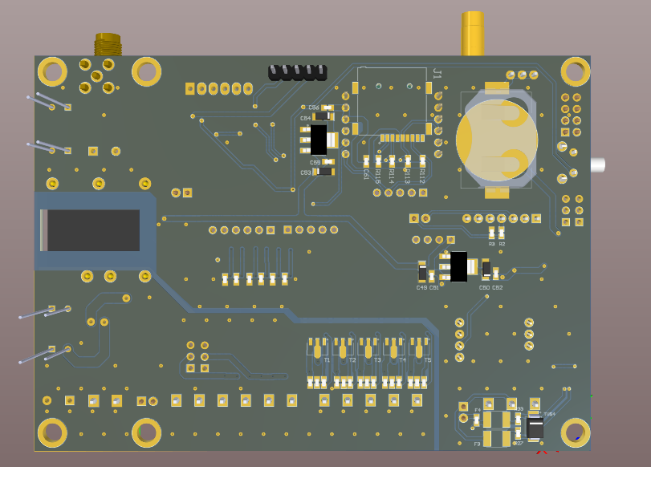
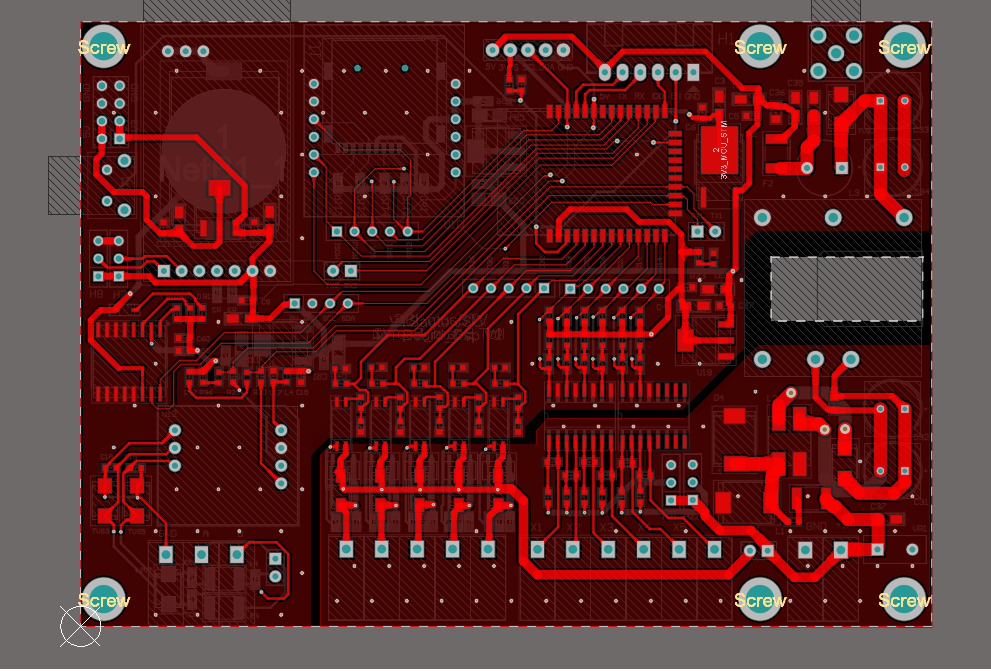
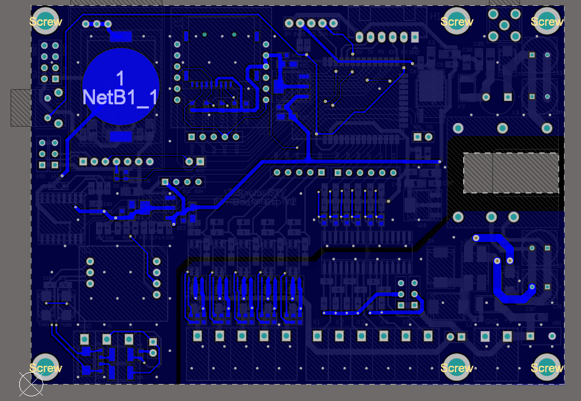

# IIOT Board ESP

👋 Welcome to the **IIOT Board ESP** project! This repository contains the design files and resources for a custom Industrial IoT (IIoT) board built around the ESP module, created using Altium Designer 21.

## 📌 Project Overview

The IIOT Board ESP is designed to facilitate Industrial IoT applications, offering robust connectivity and control features suitable for a wide range of automation environments.

### 🔧 Key Features
- **ESP Module Integration**: Optimized for IIoT use cases with Wi-Fi capabilities.
- **Industrial-Grade Components**: Ensures durability and stability in challenging environments.
- **Expandable I/O**: Multiple I/O ports for connecting sensors and actuators.
- **Power Management**: Efficient power circuitry for reliable, low-power operation.

### 📋 Specifications
- **Board Name**: IIOT Board ESP
- **Design Tool**: Altium Designer 21
- **Microcontroller**: ESP Series (customizable per project requirements)
- **Connectivity**: Wi-Fi (2.4GHz)
- **Dimensions**: Compact design for easy integration

## 📷 Board Images

| View        | Image                             |
|-------------|-----------------------------------|
| **Top View**    |       |
| **Bottom View** |  |
| **Layout Top**    |       |
| **Layout Bottom** |  |

## 🚀 Getting Started
To use or modify this design:
1. Open the `.PrjPcb` project file in **Altium Designer 21**.
2. Make adjustments as needed for your specific IIoT application.
3. Generate Gerber files or export for fabrication as required.

---

🔗 **See Also**  
- [Altium Designer 21 Documentation](https://www.altium.com/documentation/altium-designer/)
- [ESP Module Datasheet](https://www.espressif.com/en/products/socs/esp32)
## Contact

For any questions or additional support, feel free to reach out:

- **Name**: Mai Xuan Canh
- **University**: Ho Chi Minh City University of Technology (HCMUT)
- **Major**: Control and Automation Engineering
- **LinkedIn**: [Canh Mai's LinkedIn](https://www.linkedin.com/in/maixuancanh2003/)
- **Email**: canhmai.work@gmail.com

---

